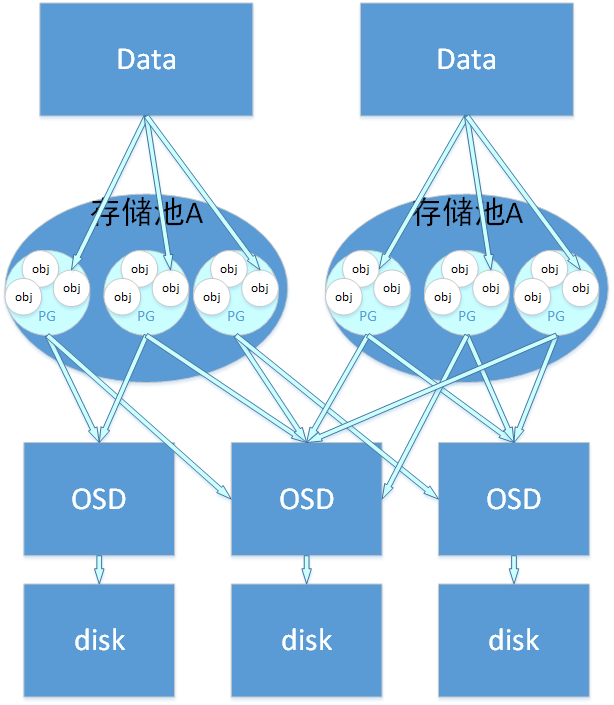
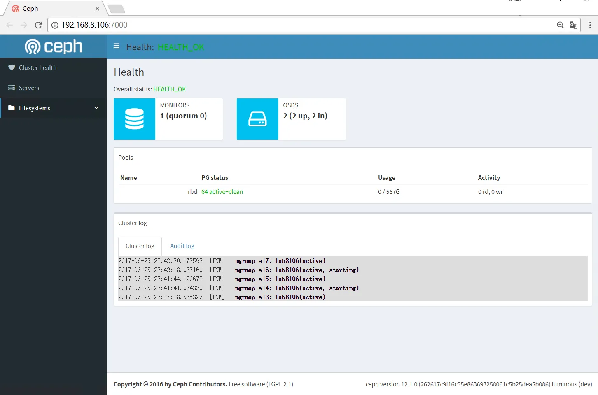

# 基于 Ceph 的 Kubernetes 数据持久化实践

## 简介
### Ceph 是什么?
Ceph 是一个可扩展的分布式存储系统，性能卓越，安全可靠，面向对象、块与文件存储。Ceph 是加州大学 Santa Cruz 分校的 Sage Weil（DreamHost 的联合创始人）专为博士论文设计的新一代自由软件分布式文件系统。自2007年毕业之后，Sage开始全职投入到Ceph开 发之中，使其能适用于生产环境。Ceph的主要目标是设计成基于POSIX的没有单点故障的分布式文件系统，使数据能容错和无缝的复制。2010年3 月，Linus Torvalds将Ceph client合并到内 核2.6.34中。

### Ceph 组件与服务
#### Ceph 组件/术语
- mon
  
  Monitor, Ceph 监视器

  集群运行起来后，你可以用 ceph 工具来监控，典型的监控包括检查 OSD 状态、监视器状态、归置组状态和元数据服务器状态。
  
- osd
  
  对象存储设备

- mgr
  
  Ceph 管理器守护进程（ ceph-mgr ）附着在监视器守护进程上，为外部的监控和管理系统提供了额外的监控和接口。

- mds
  
  Ceph Metadata Server, Ceph 元数据服务器

- Pool

  Pool是ceph存储数据时的逻辑分区，它起到namespace的作用。其他分布式存储系统，比如Mogilefs、Couchbase、Swift都有pool的概念，只是叫法不同。每个pool包含一定数量的PG，PG里的对象被映射到不同的OSD上，因此pool是分布到整个集群的。

  除了隔离数据，我们也可以分别对不同的POOL设置不同的优化策略，比如副本数、数据清洗次数、数据块及对象大小等。

- PG
  
  PG是用来存放object的，pgp相当于是pg存放osd的一种排列组合

  PG和Pool的关系：pool也是一个逻辑存储概念，我们创建存储池pool的时候，都需要指定pg和pgp的数量，逻辑上来说pg是属于某个存储池的，就有点像object是属于某个pg的。

以下这个图表明了存储数据，object、pg、pool、osd、存储磁盘的关系

  

#### Ceph 服务
- rbd
  
  块是一个字节序列（例如，一个 512 字节的一块数据），基于块的存储接口是最常见的存储数据方法，它们基于旋转媒体，像硬盘、 CD 、软盘、甚至传统的 9 磁道磁带。无处不在的块设备接口使虚拟块设备成为与 Ceph 这样的海量存储系统交互的理想之选。

  Ceph 块设备是瘦接口、大小可调且数据条带化到集群内的多个 OSD 。 Ceph 块设备均衡多个 RADOS 能力，如快照、复制和一致性， Ceph 的 RADOS 块设备（ RBD ）用内核模块或 librbd 库与 OSD 交互。

  内核模块可使用 Linux 页缓存。对基于 librbd 的应用程序， Ceph 可提供 RBD 缓存。

  Ceph 块设备靠无限伸缩性提供了高性能，如向内核模块、或向 abbr:KVM (kernel virtual machines) （如 QEMU 、依赖 libvirt 和 QEMU 的 OpenStack 和 CloudStack 云计算系统都可与 Ceph 块设备集成）。你可以用同一个集群同时运行 Ceph RADOS 网关、 Ceph FS 文件系统、和 Ceph 块设备。

- cephfs

  Ceph 文件系统（ Ceph FS ）是个与 POSIX 标准兼容的文件系统，它使用 Ceph 存储集群来存储数据。 Ceph 文件系统与 Ceph 块设备、同时提供 S3 和 Swift API 的 Ceph 对象存储、或者原生库（ librados ）一样，都使用着相同的 Ceph 存储集群系统。

- Object Gateway
  
  

  Ceph 对象网关是个对象存储接口，在 librados 之上为应用程序构建了一个 RESTful 风格的 Ceph 存储集群网关。 Ceph 对象存储支持 2 种接口：
  - S3-compatible: 提供了对象存储接口，与亚马逊的 S3 RESTful 风格的接口兼容。
  - Swift-compatible: 提供了对象存储接口，与 OpenStack 的 Swift 接口兼容。

  Ceph 对象存储使用 Ceph 对象网关守护进程（ radosgw ），它是个与 Ceph 存储集群交互的 FastCGI 模块。因为它提供了与 OpenStack Swift 和 Amazon S3 兼容的接口， RADOS 要有它自己的用户管理。 Ceph 对象网关可与 Ceph FS 客户端或 Ceph 块设备客户端共用一个存储集群。 S3 和 Swift API 共用一个通用命名空间，所以你可以用一个 API 写、然后用另一个读。

  - Ceph 对象存储不使用 Ceph 元数据服务器
  
### Ceph 功能特性
- 自动恢复

  在断电重启后，集群能快速恢复。

  在集群内部多块磁盘故障时，也能快速恢复(取决于实际磁盘数量)。

- 快照
  
  一份快照是某映像在一个特定时间点的一份只读副本。 Ceph 块设备的一个高级功能就是你可以为映像创建快照来保留其历史； Ceph 还支持分层快照，让你快速、容易地克隆映像（如 VM 映像）。 Ceph 的快照功能支持 rbd 命令和多种高级接口，包括 QEMU 、 libvirt 、 OpenStack 和 CloudStack 。

- 分级缓存

  分级缓存可提升后端存储内某些（热点）数据的 I/O 性能。分级缓存需创建一个由高速而昂贵存储设备（如 SSD ）组成的存储池、作为缓存层，以及一个相对低速/廉价设备组成的后端存储池（或纠删码编码的）、作为经济存储层。 Ceph 的对象处理器决定往哪里存储对象，分级代理决定何时把缓存内的对象刷回后端存储层；所以缓存层和后端存储层对 Ceph 客户端来说是完全透明的。

  注意结合实际场景需求定，使用前详细阅读官方文档。

- CRUSH 图
  
  CRUSH 算法通过计算数据存储位置来确定如何存储和检索。 CRUSH 授权 Ceph 客户端直接连接 OSD ，而非通过一个中央服务器或经纪人。数据存储、检索算法的使用，使 Ceph 避免了单点故障、性能瓶颈、和伸缩的物理限制。

  CRUSH 需要一张集群的地图，且使用 CRUSH 把数据伪随机地存储、检索于整个集群的 OSD 里。 CRUSH 的讨论详情参见 CRUSH - 可控、可伸缩、分布式地归置多副本数据 。

  CRUSH 图包含 OSD 列表、把设备汇聚为物理位置的“桶”列表、和指示 CRUSH 如何复制存储池里的数据的规则列表。由于对所安装底层物理组织的表达， CRUSH 能模型化、并因此定位到潜在的相关失败设备源头，典型的源头有物理距离、共享电源、和共享网络，把这些信息编码到集群运行图里， CRUSH 归置策略可把对象副本分离到不同的失败域，却仍能保持期望的分布。例如，要定位同时失败的可能性，可能希望保证数据复制到的设备位于不同机架、不同托盘、不同电源、不同控制器、甚至不同物理位置。

  当你写好配置文件，用 ceph-deploy 部署 Ceph 后，它生成了一个默认的 CRUSH 图，对于你的沙盒环境来说它很好。然而，部署一个大规模数据集群的时候，应该好好设计自己的 CRUSH 图，因为它帮你管理 Ceph 集群、提升性能、和保证数据安全性。

  例如，如果一个 OSD 挂了， CRUSH 图可帮你定位此事件中 OSD 所在主机的物理数据中心、房间、机柜和机架，据此你可以请求在线支持或替换硬件。

  类似地， CRUSH 可帮你更快地找出问题。例如，如果一个机架上的所有 OSD 同时挂了，问题可能在于机架的交换机或电源，而非 OSD 本身。

  定制的 CRUSH 图也能在归置组降级时，帮你找出冗余副本所在主机的物理位置。

- dashboard
  
  

## 应用场景
### 对象存储
一般来说，业务系统使用对象存储需求更多一些。

Harbor 也支持使用基于S3的对象存储来存储Docker镜像。

### Harbor 高可用
使用 cephfs 挂载到两台虚机的相应目录，配置目录到Harbor数据存储路径即可。

### Kubernetes 数据持久化
Ceph 与 k8s 对接的时候，通常使用两种方法：
- CSI
  
  ceph 官方提供了 CSI, 通过 kubeadm 启动的集群只能使用CSI接入。

- 传统模式
  
  传统模式下，在k8s 的所有节点安装 ceph-comm 包即可，内有 rbd 等命令。

但不管是 CSI 还是传统模式，最终我们接入k8s集群使用的时候，还是通过 Storage Class。

- storage-class.yaml

      apiVersion: storage.k8s.io/v1
      kind: StorageClass
      metadata:
        name: data
      provisioner: kubernetes.io/rbd
      parameters:
        monitors: your-ceph-monitor-servers
        adminId: admin
        adminSecretName: ceph-secret
        adminSecretNamespace: kube-system
        pool: data
        userId: kube
        userSecretName: ceph-secret-kube

- pvc.yaml

      kind: PersistentVolumeClaim
      apiVersion: v1
      metadata:
        name: data-mysql
        namespace: mysql
        annotations:
          volume.beta.kubernetes.io/storage-class: data
      spec:
        accessModes:
          - ReadWriteOnce
        resources:
          requests:
            storage: 50Gi

在 k8s 的数据持久化中，一般会面临2种比较常见的需求：
- 单点挂载读写
  
  一些应用，比如MySQL、Kafka等服务，需要将运行过程中的数据保留下来，并在Pod被重新调度的时候一并将数据调度走，才能确保被重新调度的Pod启动后仍然使用之前的数据。

  如果服务自带集群数据同步机制，如MongoDB、Elasticsearch、Kafka 等，那么使用这种模式就非常合适。

- 多点挂载读写
  
  适用于多个Pod同时读写相同数据。
  如机器学习，在同一时间，多个任务Pod可能会同时对数据进行大量读写。

## 管理维护
因为服务类型的特殊性，Ceph 的管理维护通常都是在线进行。

### 存储池 Pool
- 添加存储池
- 删除存储池
- 修改存储池
  
### 设备管理
- 移除OSD
- 更换OSD
- 新增OSD
- 新增节点可以在一定程度上视为在新增 OSD
  
### 用户权限
- 添加用户权限
- 修改用户权限
- 删除用户权限

### 监控
- 通过Zabbix/Prometheus 进行监控